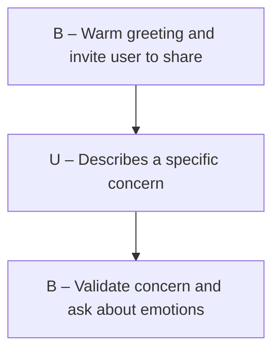

# Evaluating LLM-Derived Dialogue Flow DAGs for Mental Health Conversations

This project evaluates dialogue flow DAGs generated by large language models for mental health conversation skills. It uses adapted metrics from "Automatic Evaluation of Task-Oriented Dialogue Flows" (arXiv 2411.10416) to measure how well an LLM-designed conversation flow matches real dialogue patterns.

## Metrics

- **FuDGE** (Fuzzy Dialogue-Graph Edit Distance) — measures how closely a single conversation follows a path through a flow DAG, using sentence embeddings for fuzzy matching
- **FF1** (Flow-F1) — harmonic mean of faithfulness (does the DAG cover real conversations?) and compactness (is it parsimonious?), used to compare and rank DAGs

## LLM-Derived DAGs

Two models were used to generate mental health conversation flow DAGs in Mermaid graph format:

| DAG | Model | Nodes | Edges | Focus |
|-----|-------|-------|-------|-------|
| `dags/gpt5derived.js` | GPT-5 | 54 | 80 | Broad coverage: crisis, grounding, talk therapy, dissociation, session management |
| `dags/kimik2derived.js` | Kimik2 Instruct | 23 | 29 | Focused: post-flashback/nightmare grounding loop with optional next steps |

---

## Setup

```bash
pip install -r requirements.txt
```

The STAR dataset (Schema-guided Task-Oriented Reasoning) is used for baseline validation. It downloads automatically via HuggingFace `datasets`.

---

## Project Structure

```
DAG_Evals/
├── dags/                        # LLM-derived mental health DAGs (Mermaid format)
│   ├── gpt5derived.js
│   └── kimik2derived.js
├── src/
│   ├── graph.py                 # DialogueFlow DAG (networkx)
│   ├── embeddings.py            # Sentence-BERT (all-MiniLM-L6-v2)
│   ├── fudge.py                 # FuDGE metric (Bellman-Ford DP + naive reference)
│   ├── ff1.py                   # FF1 score
│   ├── mermaid_loader.py        # Mermaid graph parser -> DialogueFlow
│   └── data_loader.py           # STAR dataset loader
├── experiments/
│   ├── exp1_discrimination.py   # FuDGE discriminates in-task vs out-of-task
│   ├── exp2_hyperparam.py       # FF1 for optimal k selection (k-means)
│   └── exp3_sup_vs_unsup.py     # Supervised vs unsupervised flow comparison
├── results/
│   ├── INTERPRETATION.md        # STAR experiment results and analysis
│   └── MENTAL_HEALTH_DAGS.md    # How metrics apply to mental health DAGs
├── notebooks/
│   └── demo.ipynb               # End-to-end walkthrough
└── EXPLANATION.md               # Detailed algorithm and concept explanations
```

---

## Usage

### Evaluate an LLM DAG against a dialogue corpus

```python
from src.mermaid_loader import load_mermaid_flow
from src.fudge import fudge, avg_fudge
from src.ff1 import ff1_breakdown

# Load an LLM-derived DAG
flow = load_mermaid_flow("dags/gpt5derived.js")

# dialogues = list of [(actor, utterance), ...] from your corpus
score = fudge(dialogue, flow)              # single dialogue, lower = better match
avg   = avg_fudge(dialogues, flow)         # corpus average

bd = ff1_breakdown(dialogues, flow)
print(f"FF1={bd['ff1']:.3f}  faith={bd['faithfulness']:.3f}  compact={bd['compactness']:.3f}")
```

### Compare two DAGs

```python
gpt5  = load_mermaid_flow("dags/gpt5derived.js")
kimik = load_mermaid_flow("dags/kimik2derived.js")

bd1 = ff1_breakdown(dialogues, gpt5)
bd2 = ff1_breakdown(dialogues, kimik)
# Higher FF1 = better balance of coverage and parsimony
```

### Run baseline experiments (STAR dataset)

```bash
python -m experiments.exp1_discrimination     # FuDGE in-task vs out-of-task
python -m experiments.exp2_hyperparam         # FF1 k-sweep
python -m experiments.exp3_sup_vs_unsup       # supervised vs unsupervised flows
```

---

## How It Works

### FuDGE

FuDGE computes the minimum edit distance between a dialogue and any path through the flow DAG. Substitution costs use sentence embeddings (all-MiniLM-L6-v2) rather than exact matching, following the paper's Equation 8:

```
cost_sub(Br, u) = alpha * (d1(Br, u) + d2(Br, B*))
```

Where d1 is the utterance-intent distance and d2 penalises misalignment between the matched intent and the globally best intent for that utterance. The algorithm uses Bellman-Ford style iterative relaxation over the DAG for efficiency.

### FF1

```
compactness  = 1 - (flow_nodes / total_utterances)
faithfulness = 1 - avg_fudge
FF1          = harmonic_mean(compactness, faithfulness)
```

FF1 peaks at the DAG complexity that best balances coverage against parsimony.

---

## Mermaid DAG Format

LLM DAGs are stored as Mermaid graph syntax. The loader supports multiple node shapes and actor conventions:



Node labels starting with `B`/`Bot`/`Agent` are agent nodes; `U`/`User` are user nodes. Both dash (`B – text`) and colon (`Bot: text`) prefix styles are supported.

---

## Reference

```bibtex
@article{fudge2024,
  title   = {Automatic Evaluation of Task-Oriented Dialogue Flows},
  year    = {2024},
  journal = {arXiv},
  url     = {https://arxiv.org/abs/2411.10416}
}
```
